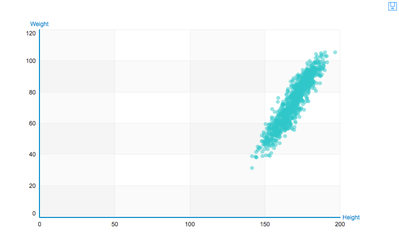
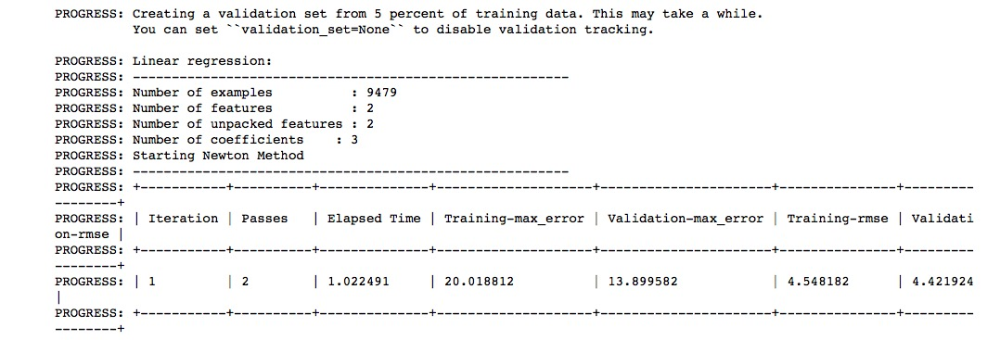
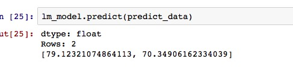
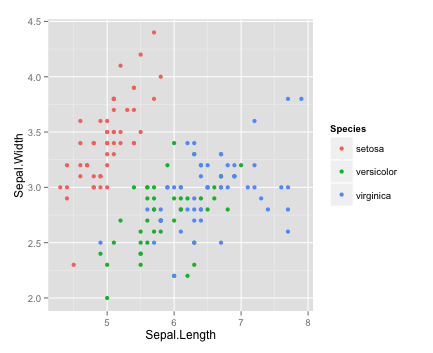
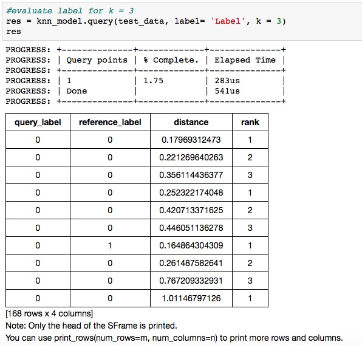

#Machine Learning with Graphlab Create

##Index

* [Overview of ML with Graphlab](#Overview-GL-Machine-Learning)
* [Implement ML with Graphlab](#GL-Machine-Learning)
* [Model Evaluation](#ML-Tricks-With-GL)
* [Combine with High Order Functions](#GL-Functional)

<h2 id='Overview-GL-Machine-Learning'>Graphlab Machine Learning Overview</h2>

**GraphLab Create** is an extensible machine learning framework that enables developers and data scientists to easily build and deploy intelligent applications and services at scale. It includes distributed data structures and rich libraries for data transformation and manipulation, scalable task-oriented machine learning toolkits for creating, evaluating, and improving machine learning models.

Graphlab Create provides essential machine learning models, in this section, we mainly covered these topics:

- linear regression
- nearest neighbour
- logistic regression
- linear support vector machine
- kmeans
- random forest

<h2 id='GL-Machine-Learning'>Implement Machine Learning With Graphlab</h2>

###Linear Regression

Creating regression models is easy with GraphLab Create, toolbox of GL contains several regression models. In the first part, we keep on to use sexual, height to predict human's weight.

import graphlab and load data

```python
import graphlab
data = graphlab.SFrame.read_csv("Downloads/MachineLearning-master/Example Data/OLS_Regression_Example_3.csv")
```

Set visualize target to ipython notebook

```python
graphlab.canvas.set_target("ipynb")
```

Replace Us metrics with cm and kilo's

```python
height_transform = lambda x:x * 2.54
weight_transform = lambda x:x * 0.45359237
data['Height'] = height_transform(data['Height'])
data['Weight'] = weight_transform(data['Weight'])
```

Visulize:

```python
data.show(view="Scatter Plot", x = "Height", y = "Weight")
```



We can spilit our data into train and test set with function *random_split*, then use train set to train a regression model.

```python
train_data, test_data = data.random_split(0.8, seed = 1)
```

Train a linear regression model

```python
lm_model = graphlab.linear_regression.create(train_data, target="Weight", features=['Gender', 'Height'])
```

And evaluate model based on test set:

```python
lm_prediction = lm_model.predict(test_data)
lm_prediction.head(5)
lm_model.evaluate(test_data)
```

RMSE equal to 4.55.

Construct a SFrame to build a test set, to predict male and female's weight of height 170 cm.

```python
predict_data = graphlab.SFrame({'Gender':['Male','Female'], "Height":[170,170]})
```



Predict based on data

```python
lm_model.predict(predict_data)
```




###Logistic Regression

As *Graphlab Create* is still under construction, this library do not provide any other classifier in Mike's blog. So we implement some available algorithms with *Graphlab*, the first one is *Logistic Regression*.

The data we used is [IRIS](https://en.wikipedia.org/wiki/Iris_flower_data_set) data set from [UCI](https://archive.ics.uci.edu/ml/datasets/Iris) Machine Learning Library, contains several kinds of flowers. We built a multiple logistic regression model to seperate these flowers.

First of all, take a look of our data:



Import graphlab and load data:

```python
import graphlab
iris_data = graphlab.SFrame.read_csv("Desktop/Q1 Course/FP/MachineLearningSamples/extradata/iris.csv")
```

Seperate IRIS dataset into train and test data:

```python
train_data, test_data = iris_data.random_split(0.8, seed = 1)
```

Train a *Logistic Regression* classifier:

```python
model = graphlab.logistic_classifier.create(train_data, target = "species", features=['sepal length', 'sepal width', 'petal length', 'petal width'])
```

After training a model, the final step is to use the model to make predictions. In other words, the model has learned a mathematical relationship between the features and the target, and it will use that relationship to predict the target value for new data points.

Predict based on test data:

```python
predictions = model.predict(test_data)
predictions
```

We can also predict result based on probability:

```python
model.predict(test_data, output_type='probability')
```

By print predictions, we are able to predict test data with trained model.

Evaluate out model:

```python
res = model.evaluate(test_data)
res['accuracy']
res['confusion_matrix']
```

The prediction accuracy is 92.3%, and it is clear that Iris-virginica and Iris-versicolor is likely to be misclassified.

###Support Vector Machine (linear)

We have had a  simple introduction of **SVM** in R's section, at the moment, graphlab only provide *linear-svm*, so we implement a simple version of svm here.

In this section, we keep using sexual, weight, height dataset for a binray classification task: using svm to classify male and female based on there weight and height.

First of all, import graphlab and load csv

```python
import graphlab
data = graphlab.SFrame.read_csv("Downloads/MachineLearning-master/Example Data/OLS_Regression_Example_3.csv")
```

Then, we split data into train set and test set:

```python
train_data, test_data = data.random_split(0.5, seed = 1)
```

Train a SVM classifier:

```python
model = graphlab.svm_classifier.create(train_data, target = "Gender", features= ["Height", "Weight"])
```

Make prediction and evaluate model with these lines of code:

```python
predictoin = model.predict(test_data)
evaluation = model.evaluate(test_data)
evaluation['accuracy']
evaluation['confusion_matrix']
```

We can see that the accuracy rate is 87.8%, this is beacause many points are overlapped, add more features is likely to help.

###Kmeans

K-means finds cluster centers for a predetermined number of clusters **K** by minimizing the sum of squared distances from each point to its assigned cluster. Points are assigned to the cluster whose center is closest.

This time, we still use *Iris* dataset without label column, try to do some cluster analysis and seperate flowers using unsupervised algorithm -- Kmeans.

As we have already know that the flower can be seperated into 3 groups, so we set k = 3.

Firstly, import graphlab and load iris data:

```python
import graphlab
iris_data = graphlab.SFrame.read_csv("Desktop/Q1 Course/FP/MachineLearningSamples/extradata/iris.csv")
```

Remove label column so we can turn the problem into a unsupervised problem:

```python
iris_data = iris_data.remove_column('species')
```

Train a *Kmeans* model, set initial clusters equal to 3:

```python
model = graphlab.kmeans.create(iris_data, num_clusters = 3)
```

Get the cluster result:

```python
cluster_result = model.cluster_id
cluster_result
```

###K-nearest-neighbour

Firstly, import graphlab library and load data:

```python
import graphlab
knn_data = graphlab.SFrame.read_csv("/Users/wbcha/Downloads/MachineLearning-master/Example Data/KNN_Example_1.csv")
```

Split data into train_data and test_data (2-fold):

```python
train_data, test_data = knn_data.random_split(0.5)
```

Train a k nearest neighbour model:

```python
knn_model = graphlab.nearest_neighbors.create(train_data, features=['X', 'Y'], label='Label', distance='euclidean')
```

Model summary:

```python
knn_model.summary()
```

Predict for test data and an unknownpoint:

```python
res = knn_model.query(test_data, label= 'Label', k = 3)
```

The predict result and distance can be visualized on Ipythonnotebook. Column *query_label* and *reference_label* represent predicted result and label of test_data respetively.



Make a unknown point with *Graphlab SFRAME* and evaluate:

```python
queries = graphlab.SFrame({'X': [5.3], 'Y': [4.3]})
knn_model.query(queries)
```

From result we can see that point [5.3,4.3] was predicted as 0 in 4 out of 5 times.


<h2 id='ML-Tricks-With-GL'>Model Evaluation</h2>

###RMSE

For regression tasks, the most commonly used technique for evaluate a machine learning algorithm is **Root Mean Squared Error**, this is defined as the square root of the average squared distance between the actual score and the predicted score.

In graphlab, if we have made predictions, it is possible to calculate the rmse error based on original label and predictions using this line of code:

```python
graphlab.evaluate.rmse(label_vector, prediction_vector)
```
###Accuracy

For most calssification tasks, accuracy rate is the most intutive way for evaluate an algorithm. It’s the ratio between the number of correct predictions and the total number of predictions (the number of test data points).

In graphlab create, this can be done with:

```python
graphlab.evaluate.accuracy(label_vector, prediction_vector)
```

###Confusion Matrix

Accuracy rate looks intuitive in most cases, but if we want to know more about a classifier on more detailed information, a **Confusion Matrix** shows correct and incorrect classifications for each class.

Graphlab also provide easy way to return a confusion matrix:

```python
graphlab.evaluate.confusion_matrix(label_vector, prediction_vector)
```

###Precision-Recall

This measure is able to provide an indication of how interesting and relevant a model's result are.

**Precision** is the percentage of positive values that are truely positive, that is, precision equals the number of true positive divide the sum of true positive and false positive.

On the ohter hand, **Recall** indicates how complete the result are, that is the number of true positive over the sum of true positive and false negative.

```python
pr_score   = graphlab.evaluation.precision(targets, predictions)
rec_score  = graphlab.evaluation.recall(targets, predictions)
```

###F1-Score

As it seems to be a bit messy if we use both **Precision** and **Recall**, **F-Score** is a combination of these two metrics into a single number.

F-measure reduces model performance to a single number, it provides a convenient way to compare several models side-by-side.

```python
graphlab.evaluation.f1_score(targets, predictions)
```

###ROC Curve


<h2 id='GL-Functional'>Functional Programming with Python</h2>