###Machine Learning with R

####Linear Regression

Read data:

```r
data <- read.csv("Downloads/MachineLearning-master/Example Data/OLS_Regression_Example_3.csv", stringsAsFactors=F))
```

Replace gender feature with 1 and 0, 1 represents Female, 0 represents Male.

```r
data$Gender[which(data$Gender=="Male")] = 0
data$Gender[which(data$Gender=="Female")] = 1
```

Replace Us metrics with cm and kilo's

```r
data$Height = data$Height * 2.54
data$Weight = data$Weight * 0.45359237
```

Plot weight and height for human:

```r
library(ggplot2)
human.plot <- ggplot(data)
human.plot + geom_point(aes(x = Height, y = Weight)) + labs(title = "Weight and heights for male and females")
```


Plot weight and height for male and female:

```r
maleFemale.plot <- ggplot(data)
maleFemale.plot + geom_point(aes(x = Height, y = Weight, color = Gender)) + labs(title = "Weight and heights for male and females")
```


train a linear model(ignore male and female difference)

```r
lm_model <- lm(Weight~Gender+Height, data=data)
summary(lm_model)
```

By summary, we can get the Model ERROR:

*Residual standard error: 4.542 on 9997 degrees of freedom*

Predict weight base on male, height = 170:

```python
test.data <- data.frame(0, 170)
colnames(test.data) <- c("Gender", "Height")
test.data$Gender <- as.factor(test.data$Gender)
predict(lm_model, test.data)
```

Result is 74.1459.

Predict weight base on female, height = 170

```python
test.data <- data.frame(1, 170)
colnames(test.data) <- c("Gender", "Height")
test.data$Gender <- as.factor(test.data$Gender)
predict(lm_model, test.data)
```

Result is 70.3558.

####Principle Component Analysis

Load data:

```r
data <- read.csv("Downloads/MachineLearning-master/Example Data/PCA_Example_1.csv", stringsAsFactors=F)
data$Date = as.Date(data$Date)
```

Transform data structure into Date, Stock1, Stock2...(group by date):

```r
data <- reshape(data, idvar = "Date", timevar = "Stock", direction = "wide")
```

Sort data by date:

```r
data <- arrange(data, Date)
```

Train a principle model:

```r
pca.model = prcomp(data[,2:ncol(data)])
PC1 <- pca.model$x[,"PC1"]
```

Add a date duration column for visualize data:

```r
duration <- 1:nrow(PC1)
PC1 <- as.data.frame(PC1)
duration <- as.data.frame(duration)
PC1 <- cbind(PC1, duration)
colnames(PC1) <- c("feature", "duration")
```

Visualize data:

```r
pc1_plot <- qplot(PC1$duration, PC1$feature)
```

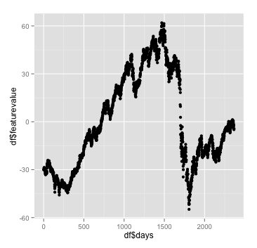

The data in plot is exactily the same as Mike's blog, but the sequence is a bit different.

Verify data:

```r
#verify data path
data.verify <- read.csv("Downloads/MachineLearning-master/Example Data/PCA_Example_2.csv", stringsAsFactors = F)
data.verify$Date <- as.Date(data.verify$Date)
#subset data, only contains 2 columns, date and close
data.verify <- data.verify[,c(1,5)]
#sort by date
data.verify <- arrange(data.verify, Date)
#add duration
duration.verify <- 1:nrow(data.verify)
duration.verify <- as.data.frame(duration.verify)
data.verify <- cbind(duration.verify, data.verify)
qplot(data.verify$duration.verify, data.verify$Close)
```

Un-normalized:

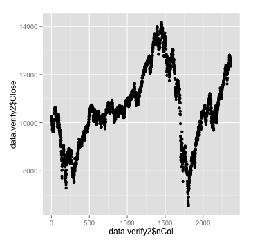

Normalized:


####Support Vector Machine

Firstly, read data from csv:

```r
train.data <- read.csv("Downloads/MachineLearning-master/Example Data/SVM_Example_1.csv", stringsAsFactors=F)
```

Take a look at our data:

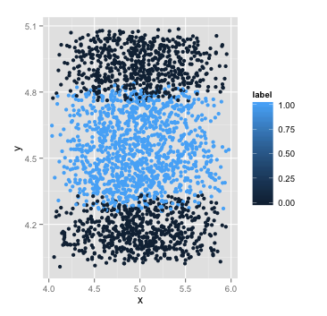

Linear classifier will not work. Instead, we use SVM & Guassian Kernel.

In order to train a svm classifier, we need to transform label feature to type *factor*, and install package *e1071*.

```r
install.packages("e1071")
library(e1071)
train.data$label <- as.factor(train.data$label)
```

Train a simple svm classifier:

```r
model <- svm(label~., data = train.data)
```

Make predict:

```r
pred <- predict(model, train.data[,1:2])
table(pred, train.data[,3])
```

We can infer the error percentage from this step, 126 points are mis-classified.

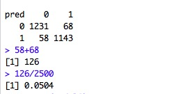

Now try to train a best svm classifier with different *sigma* and *cost*.

```r
sigma <- c(0.001, 0.01, 0.1, 0.2, 0.5, 1.0, 2.0, 3.0, 10.0)
cost <- c(0.001, 0.01, 0.1, 0.2, 0.5,1.0, 2.0, 3.0, 10.0, 100.0)
tuned <- tune.svm(label~., data = train.data, gamma = sigma, cost = cost)
summary(tuned)
```

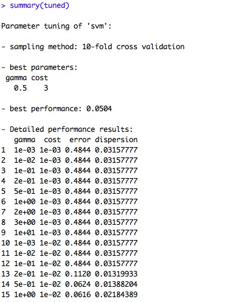

Turend function tell us the best sigma/cost pair should be 0.5/3.

With these parameters, we are able to train a new classifier

```r
model.new <- svm(label~., data = train.data, gamma = 0.5, cost = 3)
```

Combine predict result and original data:

```r
df <- cbind(train.data, data.frame(ifelse(as.numeric(predict(model.new))>1,1,0)))
colnames(df) <- c("x", "y", "label", "predict")
```

Remove *label* column:

```r
df <- df[,c(1,2,4)]
```

Transform data:

```r
predictions <- melt(df, id.vars = c("x", "y"))
```

And visualize:

```r
ggplot(predictions, aes(x, y, color = factor(value))) + geom_point()
```

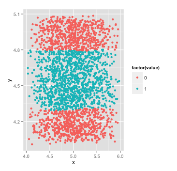

Compare original with svm-classified data:

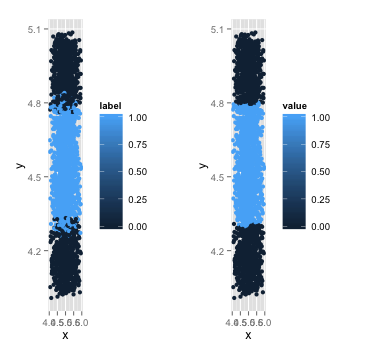

Reference:

1. [Data Mining Algorithms In R/Classification/SVM](https://en.wikibooks.org/wiki/Data_Mining_Algorithms_In_R/Classification/SVM)
2. [ML for hakers](https://github.com/johnmyleswhite/ML_for_Hackers/blob/master/12-Model_Comparison/chapter12.R)
3. [SVM example with Iris Data in R](http://rischanlab.github.io/SVM.html)
4. [Multiple graphs on one page (ggplot2)](http://www.cookbook-r.com/Graphs/Multiple_graphs_on_one_page_(ggplot2)/)

####Support Vector Machine -- Polynomial Kernel

Fisrt, take a look of our train & test data:

```r
train.data = read.csv("Downloads/MachineLearning-master/Example Data/SVM_Example_2.csv", stringsAsFactors = F)
test.data = read.csv("Downloads/MachineLearning-master/Example Data/SVM_Example_2_Test_data.csv", stringsAsFactors = F)
ggplot(train.data) + geom_line(aes(x = x, y = y, color = factor(label)))
ggplot(test.data) + geom_line(aes(x = x, y = y, color = factor(label)))
```

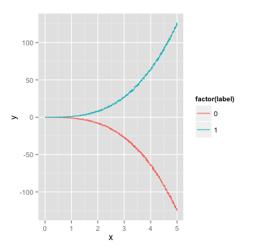
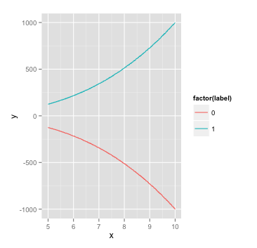

Use *polynomial* model:

```r
model <- svm(label~., data = train.data, kernel = "polynomial", degree = 3)
pred <- predict(model, train.data[,1:2])
table(pred, train.data[,3])
```

turn model with best gamma and cost:

```r
sigma <- c(0.001, 0.01, 0.1, 0.2, 0.5, 1.0, 2.0, 3.0, 10.0)
gamma <- 1/(sigma * sigma *2)
cost <- c(0.001, 0.01, 0.1, 0.2, 0.5,1.0, 2.0, 3.0, 10.0, 100.0)
tuned <- tune.svm(label~., data = train.data, gamma = gamma, cost = cost)
summary(tuned)
```

We are able to know that best performance(minimum error) is 0.

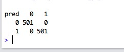


####K Nearst Neighbour

First step, load data from CSV

```r
knn.data <- read.csv("Downloads/MachineLearning-master/Example Data/KNN_Example_1.csv")
```

Visualize what the data looks like:

```r
library(ggplot2)
ggplot(knn.data) + geom_point(aes(X, Y, color = Label))
```

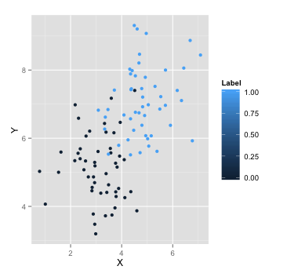

In the plot, blue and red points mixed in the area *3<x<5* and *5<y<7.5*. From Mike's blog:

>Since the groups are mixed the K-NN algorithm is a good choice, as fitting a linear decision boundary would cause a lot of false classifications in the mixed area.

Firstly, split data into train and test data with:

```r
sub <- sample(2, nrow(knn.data), replace=TRUE, prob=c(0.5, 0.5))
data.train <- knn.data[sub == 1, 1:2]
data.test <- knn.data[sub == 2, 1:2]
data.train.label <- knn.data[sub == 1, 3]
data.test.label <- knn.data[sub == 2, 3]
```

Train a knn model

```r
knn.pred <- knn(train = data.train, test = data.test, cl = data.train.label, k = 3)
```

Compare the predict data and real label of test data:

```r
knn.pred.dataframe <- as.data.frame(knn.pred)
knn.test.label <- as.data.frame(data.test.label)
knn.accuracy <- cbind(knn.pred.dataframe, knn.test.label)
```

Predict a unknown point(5.3,4.3)

```r
d1 <- 5.3
d2 <- 4.3
unknown <- cbind(d1, d2)
colnames(unknown) <- c("X", "Y")
knn.pred <- knn(train = data.train, test = unknown, cl = data.train.label, k = 3)
```

Result is 0.


