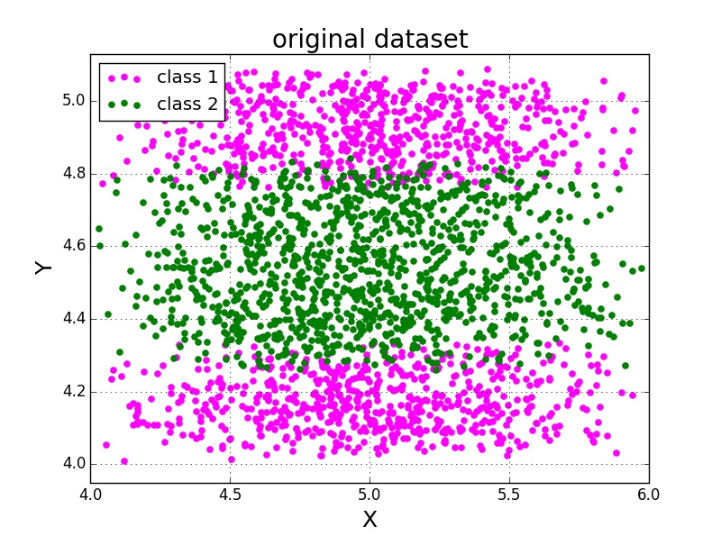
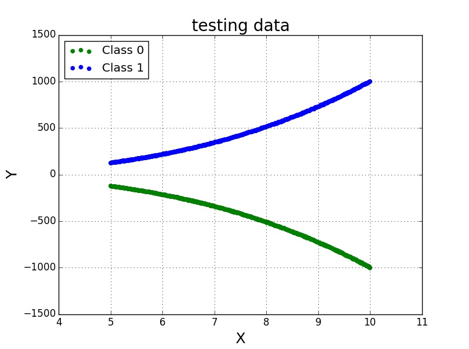
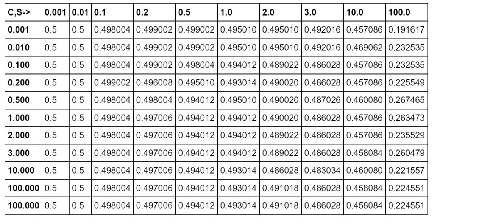
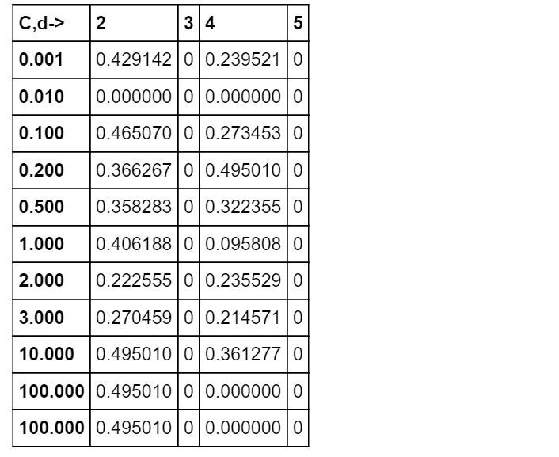

# Machine learning using Scikit-learn
## Linear Regression
Importing and reading csv data
```python
dataLocation=r'C:\Users\Yanbo Huang\Desktop\Python exercises\OLS_Regression_Example_3.csv'
data=pd.read_csv(dataLocation)
```
Data visualization  


Transfering gender property to numeric data, _inch_ to _cm_ and _bound_ to _kg_
```python
data['Gender']=(data['Gender']!='Male').astype(int)
data['Height']*=2.54
data['Weight']*=0.45359237
```
Linear regression model building
```python
Features=data[['Gender','Height']].values
Label=data['Weight'].values
regr=linear_model.LinearRegression()
regr.fit(Features,Label)
```
Weight prediction of women and man with 170cm hight  
```python
featuresTest=[[0,170.0],[1,170.0]]
print 'Input features:\n',featuresTest
print 'predictions:\n',regr.predict(featuresTest)
```
Model coefficients and weight predicitons with unit in _kg_:
> Coefficients:   
[-8.78958164,  1.06736021]  
Input features:  
[[0, 170.0], [1, 170.0]]  
predictions:    
[ **79.1453856**, **70.35580396**]

## Support Vector Machine
### SVM with Gaussian Kernal
Data visualization:




Aparently, we can not use linear SVM classifier to solve this problem. One alternative way is to use Gaussian kernal to map the original data into some complex high dimensional space to make it sparateble.  

Here we show how to realize this.  

Splitting the original data into three parts: train,cross validation,and test:
```python
# split data into :train and test
train,test=train_test_split(data,test_size=0.2)
# split train into :train and cv 
train,cv=train_test_split(train,test_size=0.2)
```
> **Dataset discriptions:**  
_Train_ : Train the SVM model  
_CV_ :  Choose model perameters  
_Test_: Give reliable test error for reporting

Exacting features and labels from different datasets:
```python
features_train=train[['x','y']].values
label_train=train['label '].values
features_cv=cv[['x','y']].values
label_cv=cv['label '].values
features_test=test[['x','y']].values
label_test=test['label '].values
```
Giving a list of parameters:
```python
sigmas=[0.001,0.01,0.1,0.2,0.5,1.0,2.0,3.0,10.0]
Cs=[0.001,0.01,0.1,0.2,0.5,1.0,2.0,3.0,10.0,100.0,100.0]
gammas=1.0/(2*(np.array(sigmas)**2))
```
Choosing the corraton rate and gamma when getting lowest _false classified ratio_ in CV dataset:  
(**_Note_**: Here we avoid using training dataset to select our model parameters. Otherwise,it is eassy to overfit the data)
```python
FCR=[]  # false classified ratio
for p in Cs:
    for g in gammas:
        svc=svm.SVC(kernel='rbf',C=p,gamma=g).fit(features_train,label_train)
        label_predict=svc.predict(features_cv)
        falseRatio=float(sum((label_cv-label_predict)**2))/len(label_cv)
        FCR.append(falseRatio)
FCR=np.array(FCR).reshape(len(Cs),len(sigmas))
print 'minimum false classified ratio in CV dataset:{0:.4}% '.format(FCR.min()*100)
svm_C=Cs[np.array(np.where(FCR==FCR.min()))[0,0]]
svm_gamma=gammas[np.array(np.where(FCR==FCR.min()))[1,0]]
# FCR table with index in C and sigma
df = pd.DataFrame(FCR, index=Cs, columns=sigmas)
df.columns.name='C,S->'  
```
The **df** in the code stands for FCR table with index in **C** and **sigma**  
(**Note**: We got the table based on _CV dataset_ instead of _training dataset_)  
Here we got :  


> minimum false classified ratio in CV dataset:  **5.0%**  

Then using model parameters which resulting this **5.0%** test error to train the model and make predication on our test dataset:
```python
svc=svm.SVC(kernel='rbf',C=svm_C,gamma=svm_gamma).fit(features_test,label_test)
label_predict=svc_final.predict(features_test)
falseRatio_test=float(sum((label_test-label_predict)**2))/len(label_test)
print 'final false classified ratio for this model is :{0:.4}%'.format(falseRatio_test*100)
```
Here we got :
> final false classified ratio for this model is :**5.8%**

### Polynomial Kernel
Data visualization  


  



Using gaussian kernal we got:



> minimum false classified ratio in test dataset:**19.16%** 

The ratio of falsely classified data in testing dataset is extremely  high by using gaussian kernal SVM.

Alternatively, we implemented polynomial kernel in our SVM model.   
```python
degrees=[2,3,4,5]
Cs=[0.001,0.01,0.1,0.2,0.5,1.0,2.0,3.0,10.0,100.0,100.0]

FCR=[]  # false classified ratio
# Gaussian kernal model
for c in Cs:
    for d in degrees:
        svc=svm.SVC(kernel='poly',degree=d,C=c).fit(features_train,label_train)
        label_predict=svc.predict(features_test)
        falseRatio=float(sum((label_test-label_predict)**2))/len(label_test)
        FCR.append(falseRatio)
FCR=np.array(FCR).reshape(len(Cs),len(degrees))
print 'minimum false classified ratio in test dataset:{0:.4}% '.format(FCR.min()*100)
svm_C=Cs[np.array(np.where(FCR==FCR.min()))[0,0]]
svm_degree=degrees[np.array(np.where(FCR==FCR.min()))[1,0]]

df = pd.DataFrame(FCR, index=Cs, columns=degrees)
df.columns.name='C,d->'
```
Here we got the FCR table and test error:  

> minimum false classified ratio in test dataset:**0.0%** 

As we can see, the polynomial kernel is superior to gaussian kernel in this case.  

## Principal component analysis  

Get the example data:  
```python
dataLocation=r'C:\Users\Yanbo Huang\Desktop\Python exercises\PCA_Example_1.csv'
data=pd.read_csv(dataLocation)  
```
Reshape the data into 24 stocks 

```python
df=data.pivot(index='Date', columns='Stock', values='Close')
```
Train the PCA model which merges the 24 features into 1 single feature

```python
pca=PCA(n_components=1)
outputData=pca.fit_transform(df)
```
Plot the results,with the feature value on the vertical axis and the individual days on the horizontal axis.


Load Dow Jones Index for verification

```python
DJIdataLocation=r'C:\Users\Yanbo Huang\Desktop\Python exercises\PCA_Example_2.csv'
DJI=pd.read_csv(DJIdataLocation)
#sort data by date
DJI=DJI[['Date','Close']].sort('Date')['Close']
```
Normolize data

```python
DJI=(DJI-DJI.mean())/(DJI.max()-DJI.min())
pcaData=(outputData-outputData.mean())/(outputData.max()-outputData.min())
```

Plot both pac outputdata and DJI for comparision


