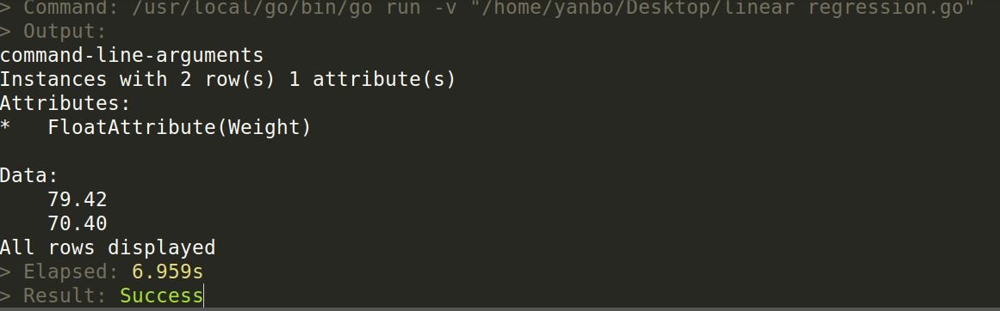

# Machine learning using golearn

This Readme file illustrates how to implement several machine learning algorithms using golang's golearn library based on the [Mike's blog](https://xyclade.github.io/MachineLearning/).

* [Enviroment Configurations](#enviroment-configurations)
* [K-Nearest Neighbors](#k-nearest-neighbors)
* [Linear Regression](#linear-regression)
* [Decision Tree](#decision-tree)
## Enviroment Configurations

1. Go Enviroment
Please refer to [this blog](https://github.com/astaxie/build-web-application-with-golang/blob/master/en/01.1.md) to  install and configure your own Go development environment.It is much easier to use the second method *Using the standard installation packages*.
**Note:** Remember to write your *GOPATH*,*GOROOT*,and current *PATH* to your **bashrc**

2. Go development tool 
Install *GoSublime*, *SidebarEnhancements* and *Go Build* in your Sublime Text.
You can still refer to [the same blog](https://github.com/astaxie/build-web-application-with-golang/blob/master/en/01.4.md) for details.

3. Start Golearn
Follow the instruction in [this blog](https://github.com/sjwhitworth/golearn)
**Note:** Don't forget to change the dataset path when you test the first *knn* example.
Till now, you can run some machine learning code in the example folder.

## K-Nearest Neighbors
Parsing CSV data:
```go
rawData, err := base.ParseCSVToInstances("KNN_Example_1.csv", true)
	if err != nil {
		panic(err)
	}
```
Initialising a new KNN classifier using **euclidean** distance for voting weight and picking **k=3**
```go

cls := knn.NewKnnClassifier("euclidean", 3)
```

Since the dataset is only 100 points, we only do 2-fold cross validation which just splits the original dataset into train and test parts.Using train part to get the model and picking test data to predict the classification.
```go
	//Do a 2-fold cross validation
	trainData, testData := base.InstancesTrainTestSplit(rawData, 0.50)
	cls.Fit(trainData)

	//predict the classification of test data
	predictions := cls.Predict(testData)
```
Here we print the precision/recall model for a better evaluation of our knn model:
```go
	// Prints precision/recall metrics
	confusionMat, err := evaluation.GetConfusionMatrix(testData, predictions)
	if err != nil {
		panic(fmt.Sprintf("Unable to get confusion matrix: %s", err.Error()))
	}
```

Reference Class|True Positives|False Positives|True Negatives|Precision	|Recall|	F1 Score
---------|:--:|:--:|:--:|:--:|:--:|:--:|
1.00000000000000|26	|	3|		25|		0.8966|		0.8667|	0.8814
0.00000000000000|25	|	4|		26|		0.8621	|	0.8929|	0.8772

Then based on this table,we generate a Overall accuracy to discribe the reliability of our model:
```go
fmt.Println(evaluation.GetSummary(confusionMat))
```
In this example, *Overall accuracy* is **0.9310**
## Linear regression

Since the *golearn* library didn't opitimize it's linear regression algorithm, it consumes much time to run. We can see that the length of our dataset is 10000 and we only have 2 features (gender and height), so it is reasonable for us to simply it,here we reduce the original dataset to 1000 male data and 1000 female data to decrease the running time.

What's more, as there is no method to easily convert our gender feature to numeric number, we use python to change **Male** to **1** and **Female** to **0**,change **inch** to **cm** and **pound** to **kg**. We export our dataset from python as *linear regression.csv*,and *linear regression test.csv*.

Load train dataset:
```go
trainData, err := base.ParseCSVToInstances("linear regression.csv", true)
if err != nil {
	panic(err)
}
```

create and trian our model:
```go
lr := linear_models.NewLinearRegression()
lr.Fit(trainData)
fmt.Println(testData)
```
Here we test the linear regression model we trained using the feature **[0,170]** and **[1,170]**.
```go
testData, err := base.ParseCSVToInstances("linear regression test.csv", true)
if err != nil {
	panic(err)
}
predictions, err := lr.Predict(testData)
fmt.Println(predictions)
```
The result is:



So, the prediction for Male of 170cm is 79.42kg, and the prediction for Female of 170cm is 70.40kg.

## Decison Tree

Decision tree is a method for approximating discrete-valued target functions, in which the learned function is represented by a decision tree. Learned tree can also be represented as sets of if-then rules to improve human readability.

Here, taking part of iris dataset for the input. The features are petal's length , petal's width, sepal's length, and sepal's width. The class of this dataset is the species of that object.

loading the iris dataset and split it into trainning and testing datasets with the splitting ratio equals 0.6.

```go
iris, err := base.ParseCSVToInstances("iris_headers.csv", true)
if err != nil {
	panic(err)
}
// training-test split
trainData, testData := base.InstancesTrainTestSplit(iris, 0.60)
```

Here, we test two algorithms wildly used in Decision Tree learning, one is ID3(Iterative Dichotomiser 3), and another one is Random forest.

Firstly, creating and training a ID3 model:

```go
tree = trees.NewID3DecisionTree(0.6)
// Train the ID3 tree
err = tree.Fit(trainData)
if err != nil {
	panic(err)
}
```
Here, one thing should be noticed is that the function of the parameter inside *trees.NewID3DecisionTree* is for controling the train-prune split.

Secondly, using the testdata to test the trained ID3 model, and creating a confusion matrix. Then, build a F1 score table based on this confusion matrix.

```go
// Generate predictions
predictions, err := tree.Predict(testData)
if err != nil {
	panic(err)
}

// Evaluate
fmt.Println("ID3 Performance (information gain)")
cf, err := evaluation.GetConfusionMatrix(testData, predictions)
if err != nil {
	panic(fmt.Sprintf("Unable to get confusion matrix: %s", err.Error()))
}
fmt.Println(evaluation.GetSummary(cf))
```
|Reference Class |True Positives|False Positives|True Negatives|Precision|Recall|F1 Score
|:---------------:|:--------------:|:---------------:|:--------------:|:---------:|:------:|:--------
Iris-virginica|26|		1|		52|		0.9630|		0.8387|	0.8966
Iris-versicolor|	20|		11|		48|		0.6452|		0.8000|	0.7143
Iris-setosa|	21|		5|		51|		0.8077|		0.7500|	0.7778|

> Overall accuracy: **0.7976**

A random forest is a meta estimator that fits a number of decision tree classifiers on various sub-samples of the dataset and use averaging to improve the predictive accuracy and control over-fitting. Since the overall accuracy is not desirable and the size of the iris dataset used here is quit small, we trained a random forest model to check whether there is any improvement of the overall accuracy. 

Being same as ID3 model, we fited the a new random forest model using the trainning dataset. The values 70 and 3 here stands for the *forestSize* and the *features* respectively. The *forestSize* controls the number of trees that get built
and the *features* controls the number of features used to build each tree.

```go
tree = ensemble.NewRandomForest(70, 3)
err = tree.Fit(trainData)
if err != nil {
	panic(err)
}
```
Then, predicting the results, building confusion matrix and generating F1 score.

```go
predictions, err = tree.Predict(testData)
if err != nil {
	panic(err)
}
fmt.Println("RandomForest Performance")
cf, err = evaluation.GetConfusionMatrix(testData, predictions)
if err != nil {
	panic(fmt.Sprintf("Unable to get confusion matrix: %s", err.Error()))
}
fmt.Println(evaluation.GetSummary(cf))
```

The final results are in the talbe as follows:

|Reference Class |True Positives|False Positives|True Negatives|Precision|Recall|F1 Score
|:---------------:|:--------------:|:---------------:|:--------------:|:---------:|:------:|:--------
Iris-virginica|	29|		3|		64|		0.9062|		0.9062|	0.9062
Iris-setosa|	35|		0|		64|		1.0000|		1.0000|	1.0000
Iris-versicolor|	29|		3|		64|		0.9062|		0.9062|	0.9062

> Overall accuracy: **0.9394**

It is clear to say that the random forest algorithm significantly rised model's overall accuracy and F1 score.